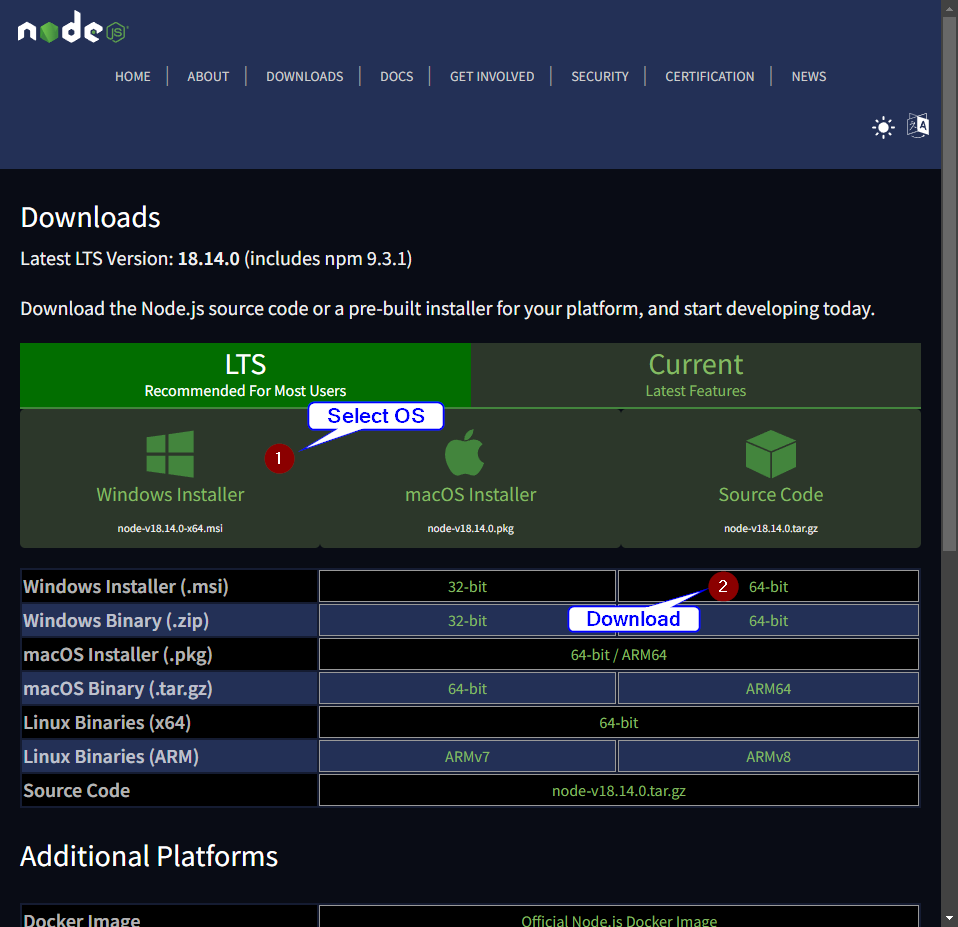
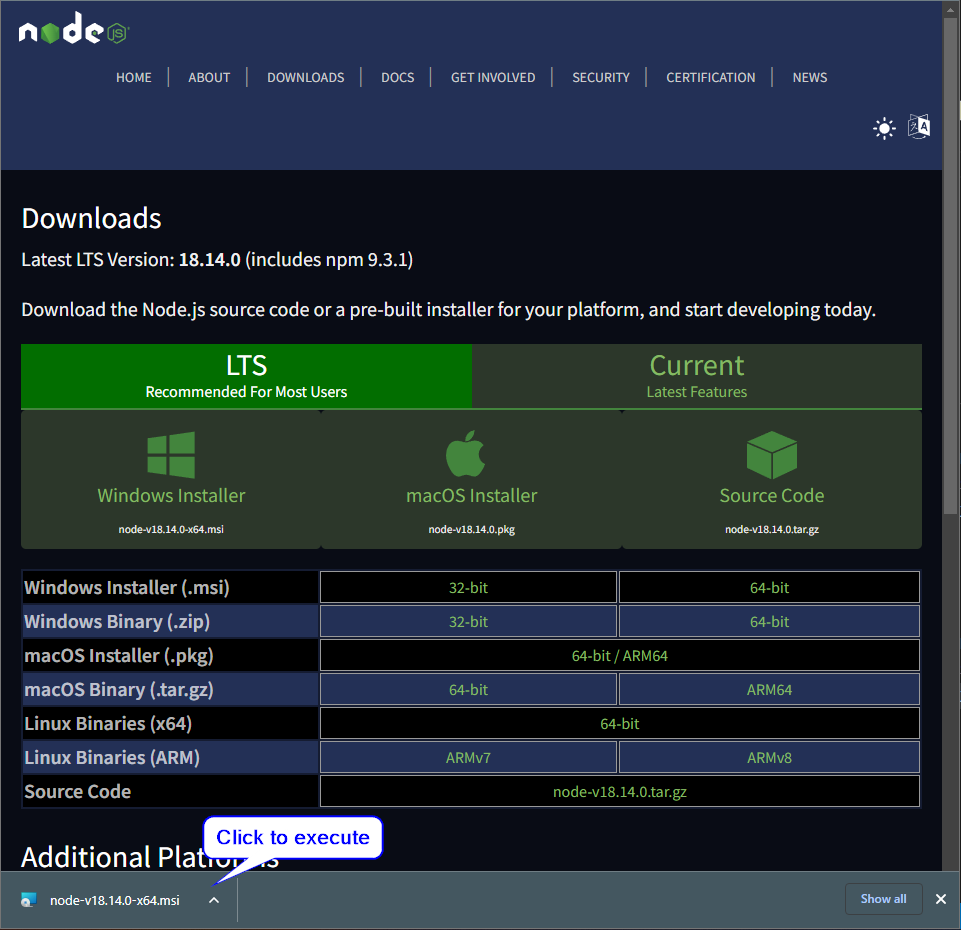
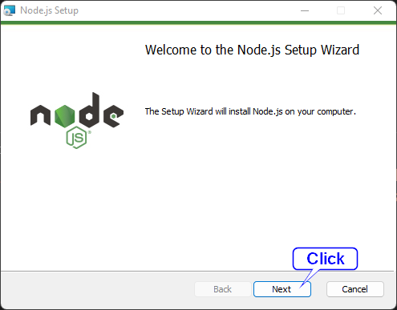
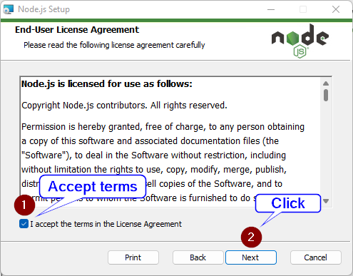
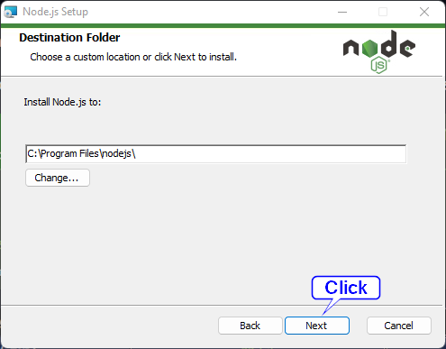
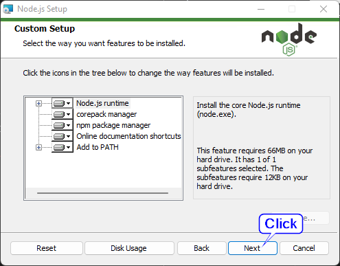
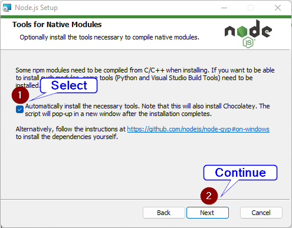
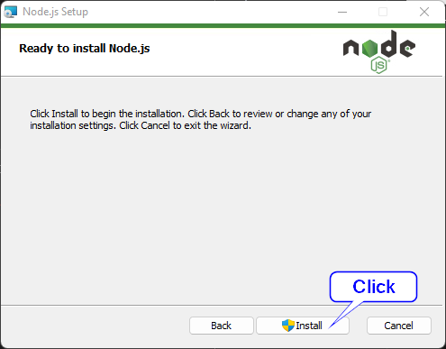

# Basic JavaScript module

---

# Setting up the environment

## Installation of Visual Studio Code

This tutorial can be found [here](https://github.com/Isaac-PM/tutorial-flask), at the "Eligiendo un editor de código" section.

## Installation of Node.js

Download and install **Node.js** from [nodejs.org](https://nodejs.org/en/download/)

















The last step is to press the `Enter` key, at the pop-up prompt, to accept the installation of additional tools.

## Extensions reccomended for Visual Studio Code

By using the [extension profiles](https://marketplace.visualstudio.com/items?itemName=evald24.vscode-extension-profiles) tool, the file `extensions.json` can be used to install the extensions that are needed.

Or you can install them manually:

- astro-build.astro-vscode
- formulahendry.code-runner
- PolymerMallard.css-alphabetize
- GitHub.copilot
- GitHub.vscode-pull-request-github
- oderwat.indent-rainbow
- VisualStudioExptTeam.vscodeintellicode
- VisualStudioExptTeam.intellicode-api-usage-examples
- xabikos.JavaScriptSnippets
- ms-vscode.vscode-typescript-next
- ms-vscode.live-server
- ritwickdey.LiveServer
- esbenp.prettier-vscode
- bradlc.vscode-tailwindcss

# Basics

## Print to the console

```javascript
console.log("Hello World!");
```

## Variables

Variables are declared using the `let` keyword, the default naming convention is camelCase.

```javascript
let myName = "John Doe";
```

### Data types

## Constants

Constants are declared using the `const` keyword.

```javascript
const MY_NAME = "John Doe";
```
